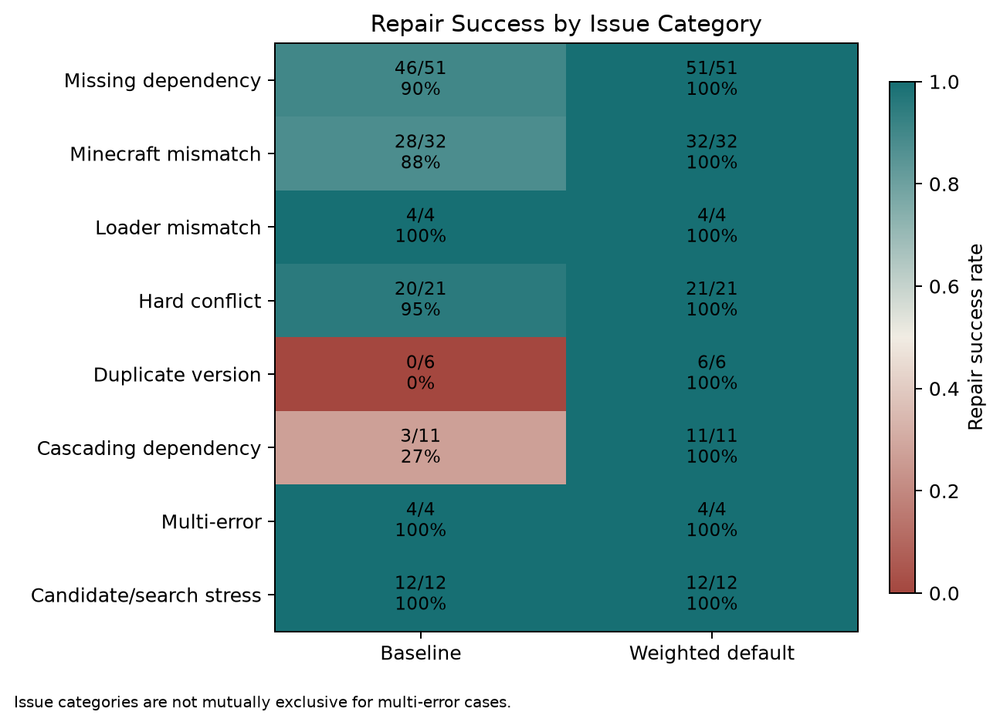
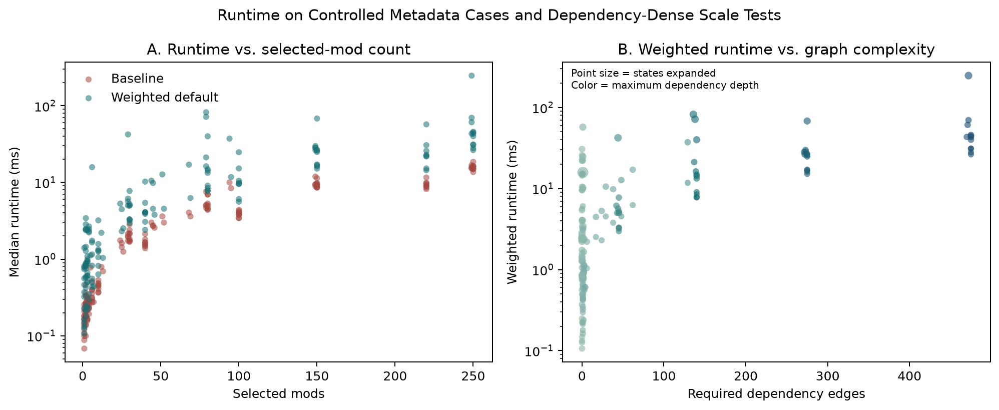

# A Weighted Dependency Solver for Diagnosing and Repairing Minecraft Modpacks

This Master's capstone prototype analyzes Fabric/Modrinth modpack metadata, identifies dependency and compatibility problems, and searches for an explainable minimum-disruption repair plan. It normalizes several input formats into one model, builds a dependency graph, checks compatibility rules, compares complete repair plans using fixed costs, and exports both readable and structured reports.



## Key Features

- Imports basic `.mrpack` manifests, validated case JSON, Modrinth URLs, and project ID/slug lists.
- Uses an offline normalized Modrinth cache by default; live API access is explicit.
- Models required, optional, incompatible, and embedded dependencies in NetworkX.
- Detects missing dependencies, version/loader mismatches, conflicts, and duplicate selections.
- Searches complete plans with default or preservation-focused repair weights.
- Explains root causes, selected actions, rejected alternatives, and repair traces.
- Provides a focused Tkinter GUI plus text and JSON exports.
- Includes a versioned 158-case evaluation corpus and archived final results.

## Scope and Limitations

The implemented scope is Fabric plus Modrinth metadata. The tool does not download or install mods, launch Minecraft, regenerate repaired `.mrpack` files, or support Forge/CurseForge. A metadata-compatible result does **not** guarantee that Minecraft will launch: runtime code conflicts and behavior outside the available metadata can still occur.

## Quick Start

Install [uv](https://docs.astral.sh/uv/), clone the repository, and run:

```powershell
uv sync --extra dev --extra research
uv run modpack-solver
```

The normal application is offline-first. To permit cache-first Modrinth requests for missing metadata:

```powershell
uv run modpack-solver --allow-live
```

`python -m modpack_solver` launches the same application from an activated environment.

## User Walkthrough

1. Select **Choose .mrpack**, open a validated JSON case, or load a built-in sample.
2. Select **Analyze Modpack** after the input summary appears.
3. Review the compatibility banner, recommended actions, weighted cost, preservation, removals, and version changes.
4. Use **Show advanced details** for issues, explanations, repair trace, graph summary, and weight settings.
5. Export a text or JSON report, copy the repair plan, or clear the workspace.

Supported inputs:

- Basic Modrinth `.mrpack` manifests with extractable project IDs; files are read but never downloaded or installed.
- Internal `SyntheticCase` JSON used by tests and cached evaluation cases.
- Modrinth mod or modpack URLs resolved from cache, with optional live fallback.
- Newline- or comma-separated Modrinth project IDs/slugs with a Minecraft version and Fabric loader.

## How It Works

1. **Normalize metadata:** importers convert external formats into typed projects, versions, dependencies, and a selected modpack configuration.
2. **Build the graph:** projects, versions, Minecraft versions, loaders, and dependency relationships become an inspectable NetworkX graph.
3. **Check compatibility:** deterministic rules identify missing requirements, loader/game mismatches, conflicts, duplicate versions, warnings, and embedded dependencies.
4. **Search repair plans:** a bounded uniform-cost search evaluates complete candidate plans and selects the lowest-cost compatible outcome with deterministic tie-breaking.
5. **Explain and export:** the result includes plain-English actions, root causes, alternatives, a replayable trace, and machine-readable JSON.

Default repair costs, from least to most disruptive:

| Action | Cost |
| --- | ---: |
| Add required dependency | 1 |
| Upgrade dependency | 2 |
| Downgrade dependency | 3 |
| Upgrade selected mod | 4 |
| Downgrade selected mod | 5 |
| Remove selected mod | 10 |
| Change Minecraft version | 20 |
| Change loader | 25 |

The preservation profile keeps dependency costs low but raises selected-mod removal and version-change penalties. Raw costs should only be compared within the same profile.

## Evaluation Highlights

The archived final corpus contains 158 offline-reproducible cases from 89 source families. Of 104 expected-repair cases, the one-pass baseline repaired 91, while both weighted profiles repaired all 104. Mean successful-repair preservation was 94.93% for the baseline, 97.46% for the default weighted solver, and 98.42% for the preservation profile. The solver also passed 11/11 cascading repairs, classified 13/13 no-solution cases correctly, and agreed with the comparable exhaustive oracle plan in 12/12 cases.

The evidence categories are intentionally distinct. Complete cached Modrinth metadata represents full normalized manifests, not redistributed official exports. Reduced real-derived examples contain only relevant metadata. Synthetic, injected, dense-topology, cascading, and search-scaling cases are controlled algorithmic evidence rather than public modpacks. Human review remains incomplete and automated checks are not a substitute for publication review.



The authoritative generated evidence is under [`results/final/`](results/final/), including the full [evaluation summary](results/final/reports/final_evaluation_summary.md). See [reproducibility notes](docs/reproducibility.md) for the distinction between the archived evaluation lock and the cleaned public package lock.

## Repository Layout

```text
src/modpack_solver/  Core models, importers, graph, checker, solvers, explanations, GUI
tests/               Deterministic unit, integration, and offline workflow tests
data/synthetic/      Small rule-focused fixtures
data/final_dataset/  Versioned final manifest, cases, provenance, and offline metadata cache
results/final/       Authoritative archived evaluation evidence
scripts/             Dataset, evaluation, review, scaling, and reproducibility commands
examples/            Small end-to-end usage example
docs/                Architecture and project images
paper/               Paper handoff location and instructions
presentation/        Presentation handoff location and instructions
```

## Reproduce and Test

Never target `results/final` during exploratory reproduction. Write to an ignored temporary directory:

```powershell
uv run python scripts/run_final_evaluation.py --offline --runtime-repetitions 3 --output-dir .artifacts/final-evaluation
uv run python scripts/run_search_scaling_experiment.py --offline --runtime-repetitions 3 --output-dir .artifacts/search-scaling
```

For a faster validation pass:

```powershell
uv run pytest
uv run modpack-solver --smoke-test
uv run python scripts/run_final_evaluation.py --offline --validate-only
uv run python scripts/run_final_evaluation.py --offline --max-cases 8 --runtime-repetitions 1 --skip-charts --output-dir .artifacts/limited-evaluation
```

The `stress` marker is excluded by default. Run it explicitly with `uv run pytest -m stress`. Live Modrinth tests require their documented opt-in environment variable.

## Academic Materials

The repository archive did not contain the completed paper source/PDF or presentation deck. See [`paper/README.md`](paper/README.md) and [`presentation/README.md`](presentation/README.md) for the expected handoff locations. Generated paper-ready tables and figures remain in `results/final/paper/`.

When citing this work, use the capstone title shown above and the final author, institution, year, and repository URL from the submitted paper. A formal citation record has not yet been added because those publication details were not present in this archive.

## License

No software license has been selected. Until the repository owner adds a `LICENSE` file, no permission to reuse, modify, or redistribute the code is granted by default.
